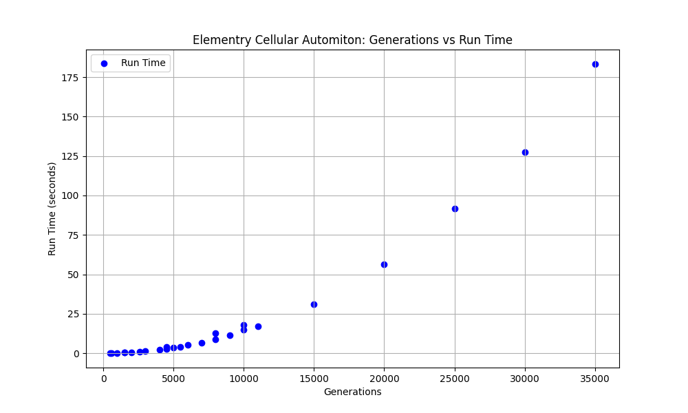
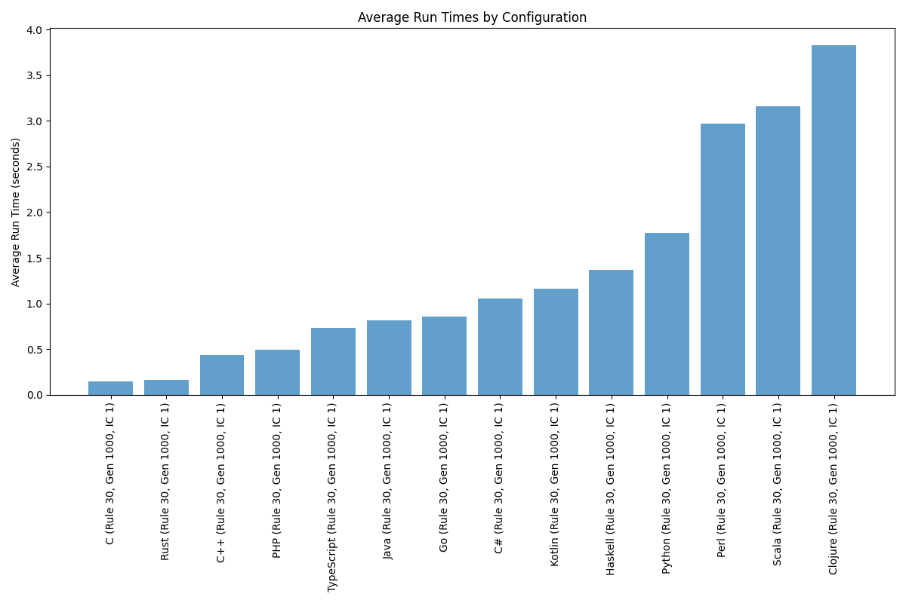
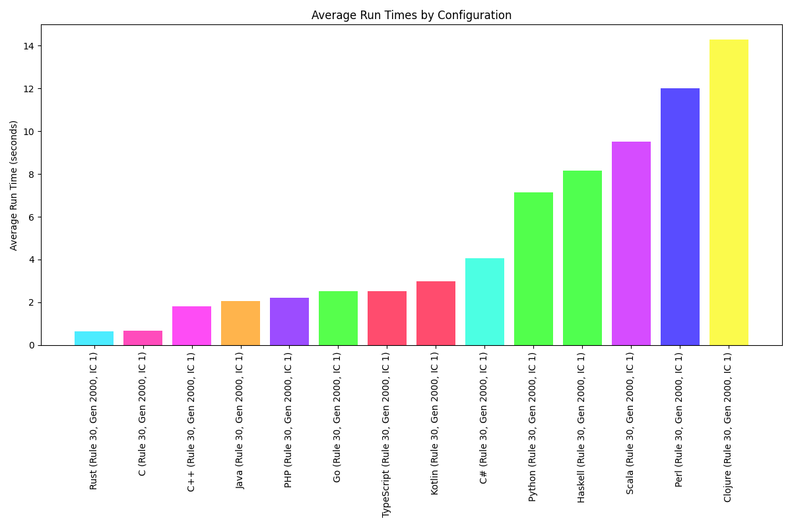

# elementry cellular automiton

## Run a specific version
Run C code:

    gcc Main.c -o results/programc ; ./results/programc

Run TypeScript code:

    deno run --allow-net --allow-read --allow-write Main.ts

Run C++ code:

    g++ Main.cpp -o results/programcpp ; ./results/programcpp

Run Haskell code:
    
    ghc -odir results -hidir results Main.hs -o results/programhaskell ; ./results/programhaskell

Run Python code: 

    python3 Main.py 

Run C# code:

    mcs -out:results/programcsharp Main.cs ; mono results/programcsharp

Run Rust code:

    rustc Main.rs -o results/programrust ; ./results/programrust 

Run Scala 3 code:

    scalac -d ./results Main.scala ; scala -cp ./results CellularAutomaton

Run Go code:

    go run Main.go

Run Clojure code:

    clojure Main.clj

Run Java code:

    javac -d results Main.java ; java -cp results Main

Run Perl code:

    ./Main.pl

Run PHP code:

    php Main.php

Run Pascal code (work in progress):

    fpc Main.pas -oresults/programpascal ; ./results/programpascal

Run Kotlin code:

    kotlinc Main.kt -include-runtime -d results/MainKT.jar ; java -jar results/MainKT.jar 

Run JavaScript code:

    node Main.js

Notice:

    You may need to manually create the `results` directory.

Input file format:

    <RULE>
    <INITIAL CONDITIONS>
    <NUMBER OF GENERATIONS>

Input file name:

    input.txt

Output File format:

    r<rule>_g<generations>_i<initial conditions>_<langauge>.pbm

    Example:

    r30_g100_i1000_cpp.pbm

## Testing

**C++** *with Valgrind*
    
    g++ -g Main.cpp -o results/programcpp ; valgrind --leak-check=full  ./results/programcpp

**C** *with Valgrind*

    gcc -g Main.c -o results/programc ; valgrind --leak-check=full ./results/programc

**Haskell** *with profiling*

    ghc -O2 -prof -fprof-auto -rtsopts -odir results -hidir results Main.hs -o results/programhaskell ; ./results/programhaskell +RTS -p -poresults/programhaskell  -RTS

## Languages To Add

- [ ] Basic
- [ ] Erlang
- [ ] Pascal
- [ ] Fortran
- [ ] COBOL
- [ ] Swift
- [ ] Ruby
- [ ] Lisp (common lisp)
- [ ] Wolfram Language
- [ ] Lean (??)
- [ ] Agda (??)
- [ ] Idris (??)
- [ ] bash
- [ ] assembly

## Compare.py

This program allows you to run multiple versions of the CA program and compare runs. 

When no arguments are supplied the program will run the programs and print how long they each took. The program will save all run data to a file called *run_data.json*. After executing each run the resulting image is hashed, these hashes are used to compare the results of the runs. The program will inform the user which images hash to the same value and which do not.

The average flag causes the program to forgo running any of the CA programs and simply display the average execution time of each language. 
    
    python3 Compare.py --average

The all command causes the program to print all run times found in the file. It will still execute the CAs and those runs will be included in the output. 
    
    python3 Compare.py --all

The runs flag can be used to specify how many times each program should be run. This can be useful when you want to graph the average run time of each program. 

    python3 Compare.py --runs 10

To graph the results of the runs use the graph flag. This will cause the program to graph the results of the runs where the X axis is the number of generations and the Y axis is the run time.

    python3 Compare.py --graph

The following command groups runs by language, rule, initial conditions, and number of generations, it takes the average for each group and creates a bar graph of the results. 

    python3 Compare.py --bar

Include the *sort* flag to sort the results by the average run time. 

    python3 Compare.py --bar --sort

The *clear* flag will clear the results folder

    python3 Compare.py --clear

### Graphing

To enable the graphing functionalities you must have matplotlib installed. You can install it with the following command:

    pip3 install matplotlib

### Run time analysis

The following plot shows the relationship between the number of generations and the run time of the program. This plot was created with the *--graph* flag. Rule 30 was used with standard initial conditions (a single active cell) each run. The only varied parameter was the number of generations. All of the runs were created with the C version of the program as of February 2nd 2024.

The following bar graph compares the run times of different versions of the program, each with the same number of genrations (1000) and the same initial conditions. 

This next graph increases the number of generations to 2000 and compares the run times of different versions of the program again. 

## compareResults.sh

This program takes two files and returns true if they hash to the same value. This is useful for comparing the output of two different implementations of the same cellular automaton program.

To run the program:

    bash compareResults.sh <file1> <file2>

The program will either print "same" or "different" to the terminal.

*Compare.py* already does this verification but the bash script may be useful in a pinch, or when you don't want to rerun the Compare.py program for whatever reason. 

## Implementaton Specific Notes

1. You may need to mark the *perl* version as executable with the following command:

    chmod +x Main.pl

## Other variations

1. It might be fun to write another C++ version with a more functional style
2. A multi-threaded version written in C would be cool

## Improvements 
1. Some versions of the program are doing more computations than necessary as they are computing cells which are unaffected by the initial conditions. The current python implementation does not have the flaw. Because of this all other versions need to be updated to reflect the logic of the python implementation. 

    A checklist of languages to update:
    - [x] Python
    - [x] C++
    - [x] TypeScript
    - [x] C
    - [ ] Haskell
    - [ ] Go
    - [ ] Scala
    - [ ] Rust
    - [x] Java
    - [ ] Clojure
    - [x] C#

2. The C version of the program calls malloc in a loop to construct essentially a 2D array. runCellularAutomaton returns char\*\*. This can potentually be reduced to a single malloc call. This solution would involve changing the return type of runCellularAutomaton to char\* and using pointer arithmetic to access the elements of the array.

3. The clojure version of the image does not hash to the same value as the other versions when the initial conditions are longer than a single cell.

4. The C++ version of the program is the third fastest, but it's still significantly slower than the C and Rust versions. If my old prof Garth Santor were here he'd say it's because my C++ code is lacking, and he'd remind me that C++ should be able to out perform C. 

## The Author

Cardano [$wildoy](https://handle.me/wildoy)

Ethereum and more [WilliamDoyle.eth](https://app.ens.domains/williamdoyle.eth)

Twitter [@william00000010](https://x.com/william00000010)

Other projects [projects.williamdoyle.ca](https://projects.williamdoyle.ca)